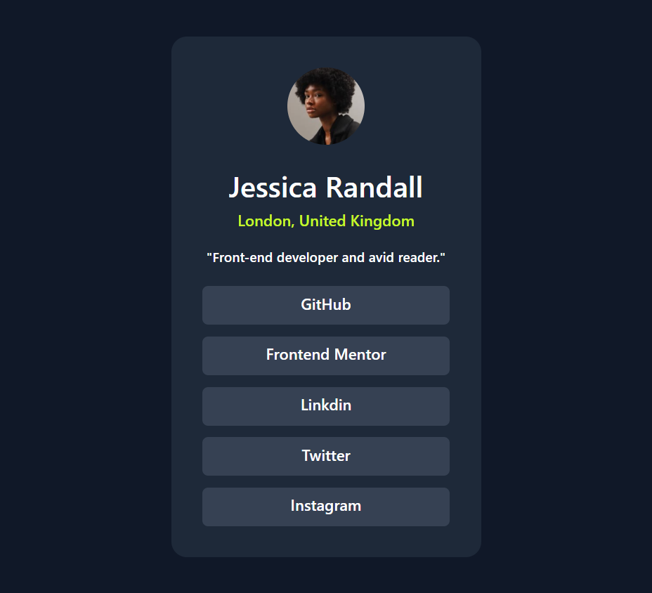
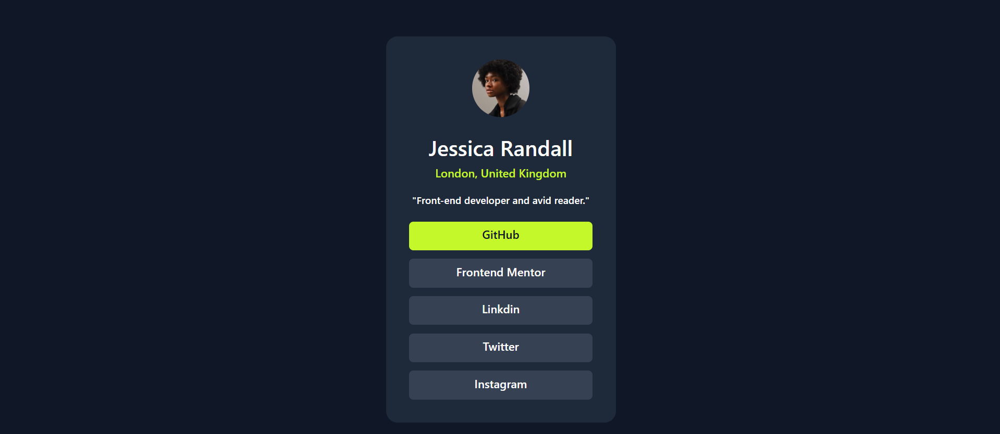

# Social Links Profile

A solution to the **Frontend Mentor - Social Links Profile** challenge built using **HTML**, **Tailwind CSS**, and responsive design principles.

## 🔧 Tech Stack

- HTML5
- Tailwind CSS (via CDN)
- Custom fonts via @font-face
- Local image and font assets

## 📐 Layout

- **Mobile width**: 375px
- **Desktop width**: 1440px
- Fully responsive layout using Tailwind utility classes

## 🎨 Style Guide

- **Fonts**: Inter (variable and static)
  - Weights: 400, 600, 700
- **Colors**:
  - Green: `hsl(75, 94%, 57%)`
  - White: `hsl(0, 0%, 100%)`
  - Gray 700: `hsl(0, 0%, 20%)`
  - Gray 800: `hsl(0, 0%, 12%)`
  - Gray 900: `hsl(0, 0%, 8%)`

## ✨ Features

- Responsive and accessible layout
- Hover effect on all social links
- Highlighted location text using a custom CSS class
- Local font loading for performance
- Mobile-first approach using Tailwind's utility classes

## 🚀 Getting Started

1. Clone this repository.
2. Open `index.html` in your browser.
3. Make sure `style.css`, fonts, and image assets are in the correct folders.
4. Use Live Server in VS Code for real-time preview.

## 🔗 Links

- [Frontend Mentor Challenge](https://www.frontendmentor.io/profile/hepinsuthar)
- [Live Demo](#) *(Add your deployed project URL here)*

---

> Designed and built based on the Frontend Mentor "Social Links Profile" challenge. Feel free to fork and customize!

